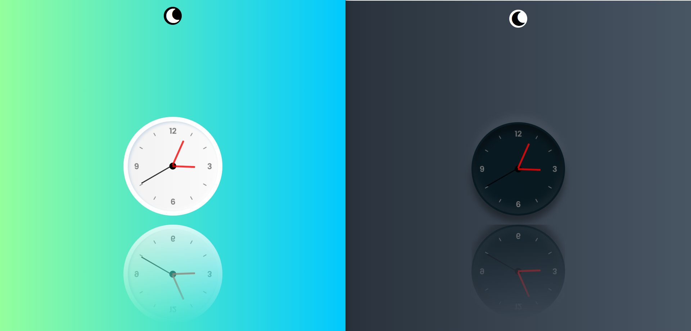

# Analog-clock

Tutorial link [click](https://youtu.be/UkN1pXCLUBE)

In this tutorial we are going to make the analog clock using basic javascript.

TOPICS COVERED :--

* setInterval()
* addEventlistener()
* -webkit-box-reflect
* toggle Classes
   
